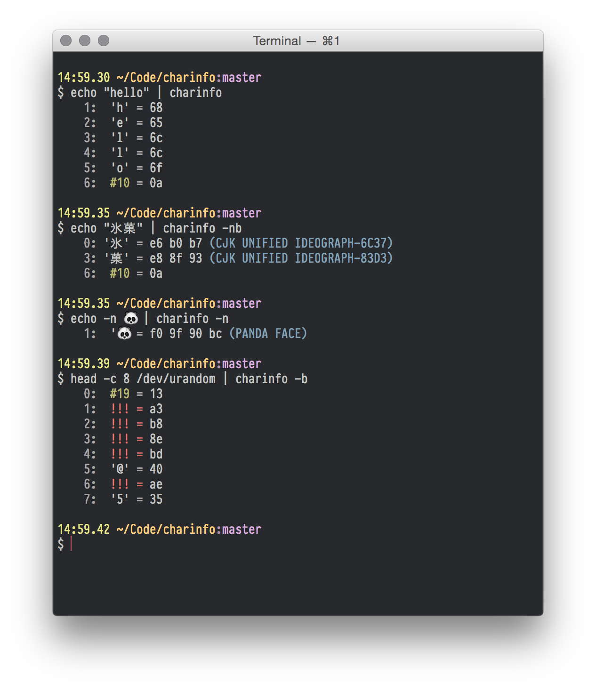

# charmander

charmander is a program that takes a stream of UTF-8-formatted data on standard input, and displays information about the characters.

- Displays characters with their numeric and hex values
- Contains list of character names
- Highlights invalid UTF-8 input in red

<!--

## Screenshot

 -->

## Options

- **-b**, **--bytes**: Show index in bytes from 0, rather than characters from 1.
- **-n**, **--names**: Display character names

## Installation

charmander is written in [Rust](http://rust-lang.org). **You will need to use Rust Nightly**, as it needs features that have not currently landed in Stable 1.0 or Beta 1.1.

After you've got it downloaded, a simple `cargo build --release` will compile charmander and put in in the `target/release` directory.
